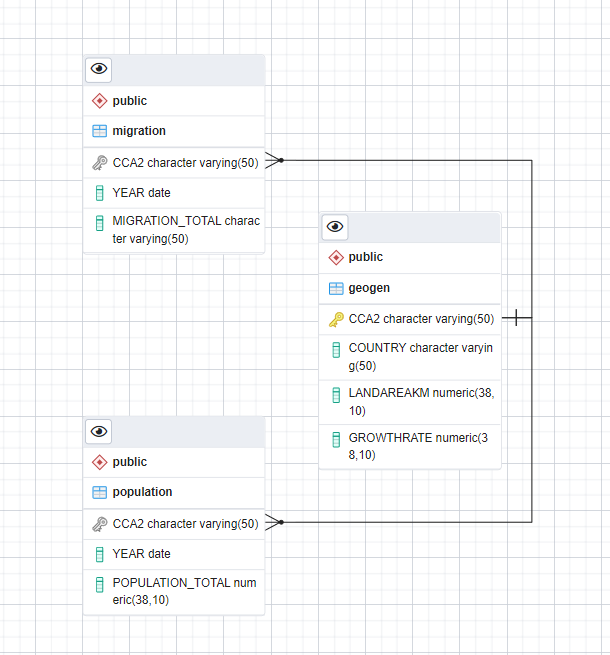
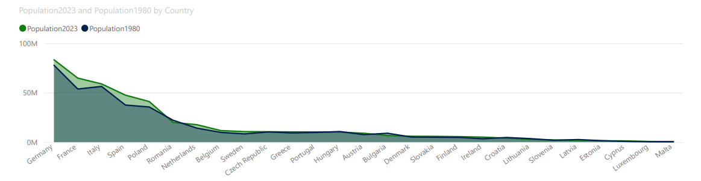
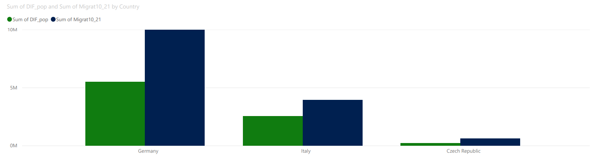

	
# World Population Analysis and Details on EU
The world's population is always changing, and migration is playing a big part in this,
including the European Union (EU). The EU has seen some interesting changes 
in its population recently. Even though the population is increasing in the EU and, 
in some places, has been decreasing, the overall population is still growing. 
This makes us curious about the role migration might be playing in this growth.

In this study, we want to explore how migration might be affecting the population 
growth in the EU. By looking
at the data and analyzing it, we hope to find valuable insights that can
contribute to addressing these issues effectively.

1. **General Information**
2. **Analysis**

    *2.1. Data Preprocessing:*

    We will carefully clean and preprocess the dataset, addressing any missing or erroneous data 
points, and ensuring consistency and accuracy.

    *2.2. Exploratory Analysis on the World*

    *2.3. Exploratory Analysis in the European Union (EU)*

    
   *2.3.1. Exploring Population Growth*

   We will analyze the EU's overall population growth over the specified time period 
   to understand the rate and nature of its expansion.

   *2.3.2. Analyzing Migration Patterns*

   We will explore migration data within the EU 
   and study how migration patterns have evolved in
   relation to population growth.

3. **Correlation Analysis**

4. **Conclusions**


## 1. General Information

### 1.1. Data Structure

We will use CCA2 like a foreign key that refers to 'geogen' table's primary key:
```sql
ALTER TABLE geogen MODIFY(cca2 PRIMARY KEY);
ALTER TABLE population ADD CONSTRAINT fk_country FOREIGN KEY(cca2) REFERENCES geogen(cca2);
ALTER TABLE MIGRATION ADD CONSTRAINT fk_country_mig FOREIGN KEY(cca2) REFERENCES geogen(cca2);
```



### 1.2. Data Source

#### 1.2.1. World Population Prospects 2022. Department of Economic and Social Affairs (United Nations).
Methodology presented 	[here.](https://population.un.org/wpp/Methodology/)

**Main variables:**

* CCA2 - country ID
* Country - name of the country
* Population Growth Rate (percentage): Average exponential rate of growth of the population 
over a given period. It is calculated as ln(P2/P1)/n where P1 and P2 
are the populations on 1 January of subsequent years, and n is the length of the 
period between t1 and t2 (n=1 for annual data). It is expressed as a percentage. In our data it is
calculated for January 1st 2023.
* Land Area (km2) - total land area of the country in square kilometers.
* Population - total population of the country per year on January 1st. 
The estimates are based on all available sources of data on population size 
and levels of fertility, mortality and international migration for 237 
distinct countries or areas.

#### 1.2.2. Eurostat. Migration and migrant population statistics. 
Methodology presented 	[here.](https://ec.europa.eu/eurostat/cache/metadata/en/migr_immi_esms.htm)

**Main variables:**

* CCA2 - country ID
* Year - the 1st January of the year
* Migration_total - total number of **long-term immigrants** arriving into the 
reporting EU country during the reference year


## 2. Analysis
### 2.1. Data Preprocessing


Check the data for missing values. 
```sql
SELECT * FROM population WHERE 
population_total IS NULL
or year IS NULL;

SELECT * FROM geogen WHERE 
country IS NULL 
or landareakm IS NULL
or growthrate IS NULL; 

SELECT * FROM migration WHERE 
year IS NULL 
or migration_total IS NULL; 
```

We have missing values for Bulgaria in Migration table for years 2010 and 2011 estimation.
We have changed them to the average value from 2011 to 2021. 
```sql
UPDATE MIGRATION 
SET 
migration_total = (SELECT AVG(migration_total) FROM MIGRATION
WHERE cca2 = 'BG' AND YEAR>'1-JAN-2011')
WHERE cca2 = 'BG' AND YEAR < '1-JAN-2012';
COMMIT;
```

Check the number of unique countries in the main table and unique foreign
keys in other tables.
It is the same numbers of unique values for world's tables 
(Geogen and Population) - 234 and
27 for European Union migration table. 
```sql
SELECT COUNT(DISTINCT country) AS uniquecountries
FROM geogen;
SELECT COUNT(DISTINCT cca2) AS uniquecountries
FROM population;
SELECT COUNT(DISTINCT cca2) AS uniquecountries
FROM MIGRATION;
```


### 2.2. Exploratory Analysis in the World

We see that the world population is increasing:
```sql
SELECT YEAR,SUM(population_total) population FROM population
GROUP BY YEAR;
```
	
| YEAR      | POPULATION |
 |-----------|-----------|
| 01-JAN-80 | 4442400374 |
| 01-JAN-00 | 6147055703 |
| 01-JAN-10 | 6983785000 |
| 01-JAN-22 | 7973413043 |
| 01-JAN-23 | 8043615390 |
| 01-JAN-30 | 8544417648 |
| 01-JAN-50 | 9707789237 |

It is shown that there are 74 countries with a population less than 1 MLN 
and 160 with a population more than 1 MLN:

```sql
SELECT COUNT(*) countries,CASE
WHEN population_total>1000000 THEN '>1mln'
WHEN population_total<1000000 THEN '<1mln'
END AS mln
FROM population
WHERE YEAR = ('01-JAN-23')
GROUP BY CASE
WHEN population_total>1000000 THEN '>1mln'
WHEN population_total<1000000 THEN '<1mln'
END;
```

| COUNTRIES | MLN|
|-----------|-------|
| 160	      |>1mln|
|  74	      |<1mln|
                      
There are countries with population more than 1 BN. 
At the beginning of the year 2023, India was the leader.

```sql
SELECT country,year,population_total FROM population P
JOIN geogen G ON (G.cca2 = P.cca2)
WHERE YEAR = '01-JAN-23' AND population_total>1000000000
ORDER BY population_total DESC;
```

| COUNTRY | YEAR      | POPULATION_TOTAL|
|---------|-----------|-----------------|
| India   | 	01-JAN-23| 1428627663|
|  China  | 01-JAN-23 | 1425671352|

It's interesting to note that China was the leader in 2022:
```sql
SELECT country,YEAR,population_total FROM population P
JOIN geogen G ON (G.cca2 = P.cca2)
WHERE YEAR = '01-JAN-22' AND population_total>1000000000
ORDER BY population_total DESC;
```
| COUNTRY | YEAR      | POPULATION_TOTAL|
|---------|-----------|-----------------|
| China   | 01-JAN-22 | 1425887337|
|  India  | 01-JAN-22 | 1417173173|

This trend is expected to continue in the future:
```sql
SELECT cca2,YEAR,population_total FROM population WHERE
cca2 IN ('CN','IN')
ORDER BY YEAR,population_total;
```
| COUNTRY    | YEAR         | POPULATION_TOTAL |
|------------|--------------|------------------|
| India      | 	01-JAN-80   | 	696828385       |
| China      | 	01-JAN-80   | 	982372466       |
| India      | 	01-JAN-00   | 	1059633675      |
| China      | 	01-JAN-00   | 	1264099069      |
| India      | 	01-JAN-10   | 	1240613620      |
| China      | 	01-JAN-10   | 	1348191368      |
| India      | 	01-JAN-22   | 	1417173173      |
| China      | 	01-JAN-22   | 	1425887337      |
| **China*** | 	*01-JAN-23* | 	*1425671352*    |
| **India*** | 	*01-JAN-23* | 	*1428627663*    |
| China      | 	01-JAN-30   | 	1415605906      |
| India      | 	01-JAN-30   | 	1514994080      |
| China      | 	01-JAN-50   | 	1312636325      |
| India      | 	01-JAN-50   | 	1670490596      |

These 2 countries make up over 35 percent of the world's population in 2023 - 
China and India:
```sql
SELECT round(((SELECT SUM(population_total) FROM population WHERE
cca2 IN ('CN','IN'))/
(SELECT SUM(population_total) FROM population))*100,2) world_prct_ID_CN
FROM population
WHERE YEAR = '01-JAN-23' AND cca2='ID';
```

| 0  | WORLD_PCT_ID_CN|
|----|---------- |
|  1 | 35.11|


The leader with a population of less than 10.000 is Vatican City. 
Vatican City is the only country located on the mainland 
among the six countries in this category.

```sql
SELECT country,population_total population FROM population P
JOIN geogen G ON (G.cca2 = P.cca2)
WHERE YEAR = '01-JAN-23' AND population_total<10000
ORDER BY population_total;
```

| COUNTRY                    |POPULATION|
|----------------------------|------------|
| Vatican City               |	518|
| Tokelau                    |	1893|
| Niue	                      |1935|
| Falkland Islands           |	3791|
| Montserrat                 |	4386|
|  Saint Pierre and Miquelon |	5840|

### 2.3. Exploratory Analysis in the European Union (EU)

The population of Europe is generally increasing, 
but it's not growing as quickly as the world population.
```sql
SELECT P.YEAR,SUM(population_total) eu_population FROM population P
WHERE P.cca2 IN (SELECT DISTINCT M.cca2 FROM MIGRATION M)
GROUP BY P.YEAR
ORDER BY P.YEAR;
```
| Year       |EU_POPULATION|
|------------|----------|
|01-JAN-80|	405627451|
|01-JAN-00|	426635023|
|01-JAN-10|	439891789|
|01-JAN-22|	447315889|
|01-JAN-23|	448922216|
|01-JAN-30|	443650120|
|01-JAN-50|	423064743|


In 2023, the population of the European Union 
represents a modest 5.58 percent of the world's total population.
```sql
SELECT round(
((SELECT SUM(population_total) FROM population 
WHERE
cca2 IN (select m.cca2 from migration m)
AND YEAR = '01-JAN-23')/
(SELECT SUM(population_total) FROM population
WHERE YEAR = '01-JAN-23'))
*100,2) world_prct_EU
FROM population
WHERE CCA2 = 'FR' AND YEAR = '01-JAN-2023';
```
| 0  | WORLD_PCT_EU|
|----|---------- |
|  1 | 5.58|

Generally, the combined population of the EU is significantly smaller 
when compared to the populations of the two largest countries - 
China and India:

```sql
SELECT DISTINCT (SELECT SUM(population_total) FROM population WHERE
cca2 IN  ('IN','CN') AND YEAR = '01-JAN-23') cn_id,(SELECT SUM(population_total) FROM population 
WHERE cca2 IN (SELECT DISTINCT cca2 FROM MIGRATION) AND YEAR = '01-JAN-23') eu
FROM population;
```
|CN_IN  | EU   |
|------|------|
|2854299015|	448922216|


In 2023, we calculated the population density for various countries in the European Union 
by dividing their total population by the land area in square kilometers.
Here are some noteworthy observations:

* The most densely populated country with the smallest country area (KM2) 
in EU is Malta.
* The less densely populated country in EU is Finland, but not with the biggest 
territory in EU.
* France has the biggest territory in EU.

```sql
SELECT G.country,P.population_total,G.landareakm,
round(P.population_total/G.landareakm,2) density_p_km2
FROM geogen G
JOIN population P ON (G.cca2=P.cca2)
WHERE P.YEAR = '01-JAN-2023' AND P.cca2 IN ('FR','FI','MT');
```
| COUNTRY      | POPULATION_TOTAL | LANDAREAKM |DENSITY_P_KM|
|--------------|------------------|------------|------------|
| **Malta**	   | 535064           | 	320*	     |1672.08*|
| **Finland**	 | 5545475          | 	303940    |	18.25*|
|  **France**	 | 64756584         | 	547557*   |	118.26|

#### 2.3.1. Exploring Population Growth

The diagram illustrates that the population growth or decrease 
was proportional to the size of each country's population in the European Union: 




There are only 2 countries in European Union have Growth rate more 
than 0.02 and the leader is Poland with Growth rate 0.0293:
```sql
SELECT G.country,growthrate FROM geogen G
JOIN MIGRATION M ON (G.cca2=M.cca2)
WHERE growthrate>0.02 AND M.YEAR = '01-JAN-2021'
ORDER BY growthrate DESC;
```
| COUNTRY   | GROWTHRATE|
|-----------|---------- |
| Poland	   |0.0293|
|  Slovakia |0.0269|

And 11 countries have negative Growth rate. 
The record holder is Bulgaria with Growth rate -0.0139:
```sql
SELECT G.country,growthrate FROM geogen G
JOIN MIGRATION M ON (G.cca2=M.cca2)
WHERE growthrate<0 AND M.YEAR = '01-JAN-2021'
ORDER BY growthrate;
```

| COUNTRY    | GROWTHRATE|
|------------|---------- |
| Bulgaria	  |-0.0139|
| Lithuania	 |-0.0115|
| Latvia	    |-0.011|
| Croatia	   |-0.0054|
| Greece	    |-0.0042|
| Italy	     |-0.0028|
| Estonia	   |-0.0025|
| Portugal   |	-0.0023|
| Germany	   |-0.0009|
| Spain	     |-0.0008|
|  Slovenia  |	-0.0001|

#### 2.3.2. Analyzing Migration Patterns

Note that from 2010 to 2021 more than 40 mln migrants came to the EU.

```sql
SELECT SUM(migration_total) eu_migration FROM MIGRATION;
```
| 0 | EU_MIGRATION|
|---|-------------|
|1|40945154.4|


We have created a table to compare the population of countries in the 
European Union between 1980 and 2023. From our observations, we noticed that 
the growth rates at the beginning of 2023 are quite low for countries with 
the largest population increases (Germany, France and Spain).


```sql
CREATE TABLE dif AS
SELECT P.cca2,G.country,YEAR,population_total,LAG(population_total)
OVER(ORDER BY P.cca2,YEAR) math80,
population_total-LAG(population_total)
OVER(ORDER BY P.cca2,YEAR) dif,G.growthrate FROM population P
JOIN geogen G ON (P.cca2=G.cca2)
WHERE YEAR IN ('01-JAN-23','01-JAN-80') 
AND P.cca2 IN (SELECT M.cca2 FROM MIGRATION M)
ORDER BY P.cca2;
SELECT * FROM dif
ORDER BY population_total DESC;
```

In fact Germany,France and Spain have received more migrants than 
other countries in the EU. It is more than 19 mln from 2010 to 2021.
And Germany is the leader with nearly 10 mln people.  

```sql
SELECT D.country,population_total pop2023,math80 pop1980,dif diff80_23,
growthrate growth2023,SUM(migration_total) migration10_21
FROM dif D
JOIN MIGRATION M ON (D.cca2=M.cca2)
WHERE D.YEAR = '01-JAN-23'
GROUP BY D.country,population_total,math80,dif,growthrate
ORDER BY dif DESC;
```

| COUNTRY        | POP2023| POP1980 | DIFF80_23 | GROWTH2023 | MIGRATION10_21 |
|----------------|---------|---------|-----------|------------|----------------|
| **France**     |	64756584|	53713830|	11042754|	0.002|	4137428 |
| **Spain**	     |47519628	|37491666	|10027962	|-0.0008|	5302245 |
| **Germany**    |	83294633|	77786703|	5507930	|-0.0009|	9964466| 
| Poland         |	41026067|	35521429|	5504638	|0.0293	|2500587 |
| Netherlands    |	17618299|	14130387|	3487912|	0.0031|	2008372| 
| Italy	         |58870762|	56329482	|2541280|	-0.0028	|3935841 |
| Sweden         |	10612086|	8311763	|2300323|	0.0059	|1404428 |
| Belgium        |	11686140|	9828986	|1857154|	0.0026	|1598694 |
| Ireland        |	5056935	|3391387	|1665548|	0.0067	|892774 |
| Austria        |	8958960	|7547561	|1411399|	0.0022	|1307402| 
| Greece         |	10341277|	9307148	|1034129|	-0.0042	|979559| 
| Slovakia       |	5795199	|4973883	|821316	|0.0269	|74674 |
| Denmark        |	5910913	|5125392	|785521|	0.0049|	756404 |
| Finland        |	5545475	|4779418	|766057|	0.0009|	378417| 
| Cyprus         |	1260138	|679327	|580811	|0.0069	|236434 |
| Portugal       |	10247605|	9785252|	462353|	-0.0023|	429154| 
| Luxembourg     |	654768|	363741|	291027	|0.0111	|271345 |
| Czech Republic |	10495295|	10270060|	225235|	0.0001|	619574 |
| Slovenia       |	2119675	|1901570	|218105	|-0.0001	|242597| 
| Malta	         |535064	|333587	|201477	|0.0033	|185828 |
| Estonia        |	1322765	|1476983|	-154218	|-0.0025|	136561 |
| Hungary        |	10156239|	10698679|	-542440|	0.019|	688279| 
| Croatia        |	4008617	|4680144|	-671527	|-0.0054	|221680| 
| Latvia         |	1830211	|2572037|	-741826	|-0.011	|117613 |
| Lithuania      |	2718352|	3521206|	-802854|	-0.0115|	306641| 
| Romania        |	19892812|	22125224|	-2232412|	0.0119|	1917363| 
| Bulgaria       |	6687717	|8980606|	-2292889|	-0.0139	|330794.4| 

And it is approximately half of all migrations in Germany, France and Spain
from 2010 to 2021:

```sql
SELECT DISTINCT
round((SELECT SUM(SUM(migration_total))
FROM MIGRATION
WHERE cca2 IN ('FR','DE','ES') GROUP BY cca2)/
(SELECT SUM(migration_total) FROM MIGRATION)*100,2) pct_migr_fr_de_es
FROM MIGRATION;
```
|    | PCT_MIGR_FR_DE_ES|
|----|------------------|
| 1 |47.39   |

The diagram indicates that Germany, Italy, and the Czech Republic, 
which experienced migrant waves before 2021, had population increasing 
from 1980 to 2023. However, the influx of migrants into these countries was 
greater than population growth. That apply us to suggest that 
one of the main factors contributing to the population growth was migration.





### 3. Correlation Analysis

Our analysis also reveals a correlation between migration patterns 
and population dynamics.
```sql
select distinct
round((select CORR(population_total,
migration_total)  
from population p
join migration m on (p.cca2=m.cca2)
where p.year = '01-JAN-10' and m.year = '01-JAN-10'),2) MG_POP_2010 ,

round((select CORR(population_total,
migration_total) 
from population p
join migration m on (p.cca2=m.cca2)
where p.year = '01-JAN-22' and m.year = '01-JAN-21'),2) MG_2021_POP_2022

from population;
```

| MG_POP_2010 | MG_2021_POP_2022 |
|-------------|------------------|
| 0.95	       | 0.92             |


### 4. Conclusions
* There is a large preponderance in the world's population 
towards large Asian countries - India and China. 
At the beginning of 2023 it is more than 35% of the world's population.
* According to forecasts, India stands as the global leader in terms of the
world's population.

* The population of the European Union is a small part of humanity, 
and it only makes up 5.58% of the world's population in 2023.
* The population of the European Union does not increase so fast
and even decreases in some countries. 
* Despite on the low growth rates some countries in EU significantly 
increase their populations.
* Migration has played a significant role in the 
population growth of certain EU countries like Germany, France and Spain.  
* Around a half of all migration in European Union occurs in these three countries:
Germany, France and Spain.


